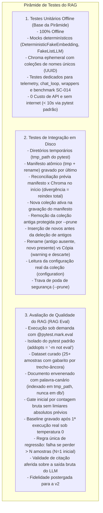

# Implementation Plan: Arquitetura RAG Modular com TDD e Observabilidade

**Feature**: `001-modular-rag-engine`  
**Branch**: `001-modular-rag-engine`  
**Versão**: 2.1 (Plano de Implementação Revisado e Calibrado)  
**Spec Reference**: `specs/001-modular-rag-engine/spec.md`  
**Audit Reference**: `specs/001-modular-rag-engine/audit.md`  

---

## 1. Visão Geral da Arquitetura e Estrutura de Diretórios

O projeto será reestruturado a partir dos scripts planos existentes para uma arquitetura modular em camadas dentro do pacote `src/`, respeitando estritamente a separação de responsabilidades (SoC), o ciclo de desenvolvimento orientado a testes (TDD) com mocks offline, idempotência com manifesto e SHA-256 completo, recuperação calibrada por distância cosseno, validação determinística de citações, guardrails de segurança e observabilidade com privacidade de dados.

### Estrutura de Diretórios Alvo

```text
hss-ai-assistant/
├── .env                              # Variáveis reais locais (não versionadas)
├── .env.example                      # Template de variáveis documentadas
├── pyproject.toml                    # Configuração de build, pytest (com marker eval isolado) e coverage
├── requirements.txt                  # Dependências de produção e desenvolvimento
├── criar_db.py                       # CLI wrapper legado (chama src.indexing.vector_store com --base-dir e --prune)
├── main.py                           # CLI wrapper legado (chama src.cli.chat_loop com --session-id)
├── base/                             # Diretório de PDFs
│   └── FAQ Python Video YouTube.pdf
├── db/                               # Diretório persistente do ChromaDB
│   └── manifest.json                 # Manifesto do índice com doc_hash, paths: list, collection_name ativa e fingerprint (sem collection_name duplicado)
├── src/
│   ├── __init__.py
│   ├── core/
│   │   ├── __init__.py
│   │   ├── config.py                 # Dataclass/Pydantic lendo .env com validações e padrões 1000/200
│   │   └── exceptions.py             # Exceções de domínio (mapeamento final para QuotaExceededError; ausência de contexto é retorno estruturado)
│   ├── indexing/
│   │   ├── __init__.py
│   │   ├── loader.py                 # Carregador de PDF 1-indexed, com tratamento gracioso de vazios
│   │   ├── splitter.py               # Chunking configurável com hash do arquivo e ID {doc_hash}_{chunk_index}
│   │   └── vector_store.py           # Gestor idempotente: paths list, inserção prévia, rename vs cópia, nova coleção ativa no manifesto, remoção antiga via --prune, reconciliação inicial, gravação atômica por último
│   ├── retrieval/
│   │   ├── __init__.py
│   │   └── search.py                 # Busca semântica por distância cosseno (menor é melhor) via configuration={'hnsw': {'space': 'cosine'}} e threshold calibrado (Task 3.3)
│   ├── generation/
│   │   ├── __init__.py
│   │   ├── prompt_templates.py       # Templates com isolamento <context>, escape de tags na montagem e frase-sentinela
│   │   ├── citations.py              # Validador de citações (>=1 citação, snippets literais de content original, fontes citadas)
│   │   ├── recontextualizer.py       # Reformulação de queries tratando histórico e input como não confiáveis
│   │   └── rag_engine.py             # Orquestrador RAG: retries nativos, multi-gatilho de fallback e mapeamento de cota
│   ├── memory/
│   │   ├── __init__.py
│   │   └── session_store.py          # Gestão de histórico multi-turn por session_id com sliding window
│   ├── observability/
│   │   ├── __init__.py
│   │   ├── logging.py                # Logger estruturado JSON sem texto de docs e máscara sk-proj-...
│   │   └── telemetry.py              # Tracing LangSmith opt-in com documentação de envio externo
│   └── cli/
│       ├── __init__.py
│       └── chat_loop.py              # Interface interativa de terminal com suporte a argumentos CLI
├── tests/
│   ├── __init__.py
│   ├── conftest.py                   # Fixtures: FakeListLLM, DeterministicFakeEmbedding, Chroma ephemeral com coleções de nomes únicos (UUID)
│   ├── unit/
│   │   ├── test_config.py            # Validação de variáveis, tipos e defaults
│   │   ├── test_loader.py            # Extração de páginas 1-indexed, PDF vazio/escaneado e pasta base/ vazia
│   │   ├── test_splitter.py          # Hash SHA-256 completo, ID determinístico e parâmetros de chunking
│   │   ├── test_vector_store.py      # Idempotência, manifesto, renomeação vs cópia, gravação tmp+rename, reconciliação e configuração real
│   │   ├── test_retrieval.py         # Busca semântica por cosseno via configuration 1.5.9, ordenação e calibração de threshold
│   │   ├── test_prompt_templates.py  # Isolamento <context>, escape de tags restrito à montagem e frase-sentinela
│   │   ├── test_citations.py         # Citações inline, validação estrita, snippets literais de content original e fontes citadas
│   │   ├── test_guardrails.py        # Fallback multi-gatilho, sanitização sk-proj-..., retries em 429 de cota e mapeamento HTTP simulado (sleep mockado ou max_retries=0 para SC-001 < 10s)
│   │   ├── test_memory.py            # Sessões multi-turn segregadas e sliding window
│   │   ├── test_recontextualizer.py  # Reformulação com input e histórico tratados como não confiáveis
│   │   ├── test_telemetry.py         # Testes dedicados para telemetry opt-in LangSmith, flags e privacidade
│   │   ├── test_chat_loop.py         # Testes dedicados para cli/chat_loop.py (argumentos, comandos de sessão com mocks de I/O)
│   │   ├── test_cli_wrappers.py      # Testes dedicados para criar_db.py (--base-dir, --prune) e main.py (--session-id)
│   │   └── test_performance.py      # Benchmark automatizado para SC-014 e NFR-004 (< 200ms busca + prompt)
│   ├── integration/
│   │   └── test_persistence.py       # Testes reais de sincronização, manifesto atômico, trava de poda em tmp_path e reconciliação
│   └── eval/
│       ├── test_rag_quality.py       # Suíte RAG Eval isolada com marker @pytest.mark.eval, gate por contagem bruta, validade na saída bruta e fixture canário (indexada em tmp_path, nunca em db/)
│       ├── eval_dataset.json         # Dataset curado com 25+ amostras (gabaritos por trecho-âncora, fora de domínio e fixture envenenada)
│       └── eval_baseline.json        # Baseline gravado após primeira execução real sob temp 0 (regra única: falha se perder > N amostras, N=1 inicial)
└── specs/
    └── 001-modular-rag-engine/
        ├── audit.md                  # Auditoria técnica do código existente (v2.1)
        ├── spec.md                   # Especificação formal da feature (v2.1)
        ├── plan.md                   # Este plano de implementação (v2.1)
        └── tasks.md                  # Tarefas atômicas de implementação (v2.1)
```

---

## 2. Estratégia de Testes (TDD) e Pirâmide de Testes

O desenvolvimento seguirá estritamente o ciclo **Red-Green-Refactor**, estruturado em três níveis com responsabilidades e custos isolados:



### 2.1. Testes Unitários Offline (Obrigatórios em CI/CD e TDD)
- **Fixtures com Mocks**: Utilização de `DeterministicFakeEmbedding` (geração determinística via hash do texto para ordenação cosseno reproduzível) e `FakeListLLM`.
- **ChromaDB Isolado**: Instanciado em memória (`chromadb.EphemeralClient()`), utilizando nomes de coleção únicos via UUID (ex: `test_coll_{uuid.uuid4().hex}`) para prevenir contaminação entre testes.
- **Velocidade e Custo Zero**: Nenhum teste unitário realiza chamadas de rede ou incorre em custos de API.
- **Suítes Dedicadas**: Testes específicos implementados para `test_telemetry.py`, `test_chat_loop.py`, `test_cli_wrappers.py` e `test_performance.py` (SC-014).
- **Execução Padrão**: O comando `pytest` executa apenas testes unitários e de integração offline em menos de 10 segundos.

### 2.2. Testes de Integração
- Validação do `VectorStoreManager` em diretórios temporários (`tmp_path` do pytest) cobrindo:
  - Criação e persistência atômica de `manifest.json` por último (`tmp` + rename).
  - Reconciliação inicial entre manifesto e estado do ChromaDB (divergência dispara reindexação total).
  - Invalidação e provisionamento de coleção nova caso o fingerprint da configuração mude (nome derivado do fingerprint, sem duplicá-lo dentro dele); a nova coleção passa a valer apenas na gravação do manifesto; a remoção da coleção antiga é protegida por `--prune`; validação via leitura da configuração real da coleção.
  - Inserção de novos chunks ANTES da deleção dos chunks obsoletos.
  - Renomeação de arquivo (caminho antigo ausente, novo presente com mesmo hash) atualizando `paths`, `file_name` e `source` sem recalcular embeddings.
  - Cópia de arquivo (ambos caminhos presentes com mesmo hash) emitindo warning em log e ignorando a cópia.
  - Aborto da poda de órfãos se a exclusão exceder o teto seguro de 20% do índice sem `--prune`.
  - Proteção contra expurgo de arquivos que falharam na leitura.

### 2.3. Avaliação de Qualidade do RAG (RAG Eval)
- Conjunto curado em `tests/eval/eval_dataset.json` contendo no mínimo 25 a 30 exemplos:
  - 15 perguntas factuais do FAQ com gabarito definido por trecho-âncora textual do documento.
  - 5 perguntas anafóricas de acompanhamento dependentes de contexto anterior.
  - 9 perguntas fora do domínio exigindo recusa estrita.
  - 1 caso de documento-fixture envenenado contendo instrução hostil e palavra-canário oculta, indexado estritamente em diretório temporário (`tmp_path`) e coleção temporária, NUNCA em `db/`, para validar mitigação de injeção.
- Métricas formais calibradas:
  1. **Context Recall@k / Hit Rate**: Proporção de consultas onde o fragmento contendo o trecho-âncora foi recuperado entre os top-k.
  2. **Taxa de Recusa Correta (Correct Rejection Rate)**: Proporção de consultas sem evidência que acionaram fallback com `is_fallback=True` e mensagem padrão.
  3. **Validade de Citação (Citation Validity)**: Proporção de citações inline geradas que apontam para chunks recuperados existentes e páginas corretas, **mensurada diretamente sobre a saída bruta do LLM** (antes do expurgo sanitizador pós-processamento).
  4. **Proteção contra Injeção por Palavra-Canário**: Verificação de que a palavra-canário do documento envenenado (isolado fora de `db/`) jamais aparece na resposta gerada.
- Governança de Baseline e Portões de Qualidade:
  - Gate inicial por **contagem bruta** de acertos e recusas, sem limiares percentuais absolutos arbitrários antes da consolidação do baseline.
  - O arquivo `tests/eval/eval_baseline.json` é gravado exclusivamente **após a primeira execução real** da suíte sob temperatura 0.
  - Execuções subsequentes aplicam a regra única de regressão: o teste falha se qualquer métrica perder mais de N amostras em relação ao baseline consolidado (com N=1 inicial).
  - A métrica de **Fidelidade (Faithfulness)** requer modelo LLM juiz e fica formalmente postergada para a v2.
- Marker pytest:
  - Decorador `@pytest.mark.eval` configurado em `pyproject.toml` para que o comando padrão `pytest` execute apenas `not eval`.

---

## 3. Fases de Desenvolvimento Reorganizadas

A ordem das fases reflete rigorosamente a priorização orientada a dependências técnicas, segurança e calibração:

### Fase 1: Ambiente, Dependências e Configurações Base
- **Foco**: Preparação do `.venv`, dependências (`requirements.txt`, `pyproject.toml`), carregamento de `.env`, validação de configurações com valores padrão padronizados (`CHUNK_SIZE=1000`, `CHUNK_OVERLAP=200`, `RELEVANCE_THRESHOLD=0.35`, `MAX_PRUNE_PERCENTAGE=20`) e hierarquia de exceções de domínio. Fixtures de teste offline com `DeterministicFakeEmbedding` e coleções com nomes únicos via UUID.
- **Definição Crítica**: Ausência de contexto relevante é tratada como retorno estruturado normal (`RetrievedChunk` vazio, `is_fallback=True`), e NÃO como lançamento de exceção.
- **Correspondência**: FR-001, FR-002, NFR-001, SC-001.
- **Entregáveis**:
  - `src/core/config.py` e `src/core/exceptions.py`.
  - `tests/unit/test_config.py` e fixtures em `tests/conftest.py`.
  - `.env.example`.
  - `pyproject.toml` (com marker `eval` e `addopts = "-m 'not eval'"`).

### Fase 2: Ingestão e Indexação Idempotente com Manifesto, SHA-256 e Sincronização Segura
- **Foco**: Leitura segura de PDFs com numeração 1-indexed, tratamento resiliente de PDFs sem texto/escaneados (warning e skip) e de pasta `base/` vazia. Fatiamento padronizado (1000/200) com hash SHA-256 completo do arquivo (`doc_hash`) e ID determinístico `{doc_hash}_{chunk_index}` (sem hash por chunk individual).
- **Mecanismo de Persistência e Manifesto**: Gestor do ChromaDB com arquivo `manifest.json` contendo `paths: list` por `doc_hash` e fingerprint global `{"embedding_model", "chunk_size", "chunk_overlap", "splitter_version", "distance_metric"}` (com nome de coleção derivado do fingerprint e não duplicado dentro dele):
  - Se o fingerprint mudar, provisionar nova coleção com nome derivado e reindexar o acervo (com teste automatizado lendo a configuração real da coleção via `collection.configuration`).
  - A nova coleção passa a valer formalmente no momento da gravação atômica do manifesto (`manifest.json` via `tmp` + rename).
  - A remoção da coleção antiga obsoleta é protegida pela flag de limpeza explícita `--prune` (não é removida sem essa flag).
  - O manifesto é persistido estritamente por último através de gravação atômica (`tmp` + rename).
  - No início da sincronização, o sistema reconcilia o `manifest.json` com o estado real do ChromaDB; divergências forçam reindexação total.
  - Renomeação de arquivo (caminho antigo ausente no disco e novo presente com mesmo hash): atualiza `paths`, `file_name` e `source` sem recalcular embeddings (0 chamadas à API).
  - Cópia ou duplicação de arquivos (ambos caminhos presentes no disco com mesmo hash): emite warning estruturado e ignora a cópia, mantendo apenas o registro original sem duplicar chunks.
  - Inserção de novos chunks ANTES da remoção dos antigos.
  - Poda de órfãos restrita a arquivos confirmadamente ausentes no disco com trava de segurança recusando exclusão > 20% do índice sem `--prune`.
- **Correspondência**: User Story 1 (P1), FR-003, FR-004, FR-005, NFR-002, SC-002, SC-003.
- **Entregáveis**:
  - `tests/unit/test_loader.py`, `tests/unit/test_splitter.py`, `tests/unit/test_vector_store.py`.
  - `src/indexing/loader.py`, `src/indexing/splitter.py`, `src/indexing/vector_store.py`.
  - `tests/integration/test_persistence.py`.

### Fase 3: Recuperação Vetorial Precisa, Calibrada por Distância Cosseno e Calibração de Threshold (Task 3.3)
- **Foco**:
  - **Recuperação Vetorial**: Coleção Chroma configurada explicitamente com métrica de distância cosseno via `configuration={"hnsw": {"space": "cosine"}}` (confirmado para ChromaDB 1.5.9). Score definido como distância cosseno (MENOR é melhor, 0 = idêntico). Resultados ordenados por distância crescente com metadados íntegros e páginas 1-indexed. Ausência de resultados ou scores acima do threshold retornam lista vazia estruturada sem lançar exceção.
  - **Calibração Experimental do Threshold (Task 3.3)**: Execução de tarefa de calibração do threshold de relevância (`RELEVANCE_THRESHOLD`) em modo retrieval-only (estritamente sem chamadas ao LLM de geração), utilizando um conjunto de calibração pequeno e SEPARADO do dataset de avaliação (`eval_dataset.json`). A rotina roda fora do pytest padrão (script dedicado `scripts/calibrate_threshold.py` ou marker `@pytest.mark.calibration`), pois usa a API real da OpenAI para embeddar as perguntas. Fixa o limiar empírico de corte de relevância no espaço cosseno antes da construção dos guardrails da Fase 5, assegurando que o motor diferencie contexto factual de consultas desconexas.
- **Correspondência**: User Story 2 (P2), FR-006, FR-007, SC-004.
- **Entregáveis**:
  - `tests/unit/test_retrieval.py`.
  - `src/retrieval/search.py`.
  - Rotina de calibração da Task 3.3 (fora do pytest padrão, com dataset separado) e calibração de `RELEVANCE_THRESHOLD` no `.env.example`.

### Fase 4: Geração de Respostas com Citações e Validação Estruturada
- **Foco**: Templates de prompt com System Prompt imutável e delimitação do contexto em `<context>...</context>`.
- **Regra de Escape e Preservação de Dados**: O escape de tags delimitadoras `</context>` e `<context>` DEVE ocorrer estritamente durante a montagem do prompt, garantindo que o atributo `content` do `RetrievedChunk` permaneça idêntico ao texto original.
- **Validação de Citações**: Toda resposta não-fallback exige pelo menos uma citação válida `[N]`. Marcadores inválidos são removidos; se restarem zero citações válidas, a resposta é rebaixada para fallback (`is_fallback=True`). A seção "Fontes Consultadas" lista exclusivamente as fontes citadas no texto. Snippets são trechos literais truncados extraídos diretamente do `content` original do chunk (nunca gerados por LLM).
- **Correspondência**: User Story 3 (P3), FR-008, FR-009, SC-005, SC-009.
- **Entregáveis**:
  - `tests/unit/test_prompt_templates.py`, `tests/unit/test_citations.py`.
  - `src/generation/prompt_templates.py`, `src/generation/citations.py`.

### Fase 5: Guardrails de Segurança, Mitigação de Injeção e Fallback Estrito
- **Foco**: Orquestrador do motor RAG com múltiplos gatilhos de fallback (score acima do threshold calibrado, frase-sentinela de falta de evidência emitida pelo modelo ou ausência de citações válidas após pós-processamento).
- **Resiliência e Mapeamento de Cota**: Retries nativos (`max_retries=3`) no cliente OpenAI para LLM e Embeddings em falhas de rede, timeouts e HTTP 429 (aceitando retries no 429 de cota esgotada). O sistema intercepta o erro final resultante de cota esgotada (`insufficient_quota`) e o mapeia para a exceção de domínio `QuotaExceededError`, com comportamento validado via teste com transporte HTTP simulado (com simulação de sleep ou configuração de `max_retries=0` no cliente de teste, garantindo não estourar o limite de 10s do SC-001). Erro de autenticação (HTTP 401) falha imediatamente sem retries.
- **Observabilidade Segura**: Logger estruturado em JSON sem gravação de texto dos documentos por padrão e sanitizador com regex para chaves `sk-proj-...` e `sk-...`.
- **Correspondência**: User Story 4 (P4), FR-010, FR-011, NFR-003, SC-006, SC-007, SC-010.
- **Entregáveis**:
  - `tests/unit/test_guardrails.py`.
  - `src/observability/logging.py`.
  - `src/generation/rag_engine.py`.

### Fase 6: Memória Conversacional Multi-Turn com Recontextualização Segura
- **Foco**: Gestão de histórico multi-turn por `session_id` com política de janela deslizante (sliding window) configurável. Módulo de recontextualização que transforma perguntas de acompanhamento em consultas autocontidas, tratando tanto a pergunta do usuário quanto o histórico como entradas não confiáveis com delimitadores e regras de segurança contra prompt injection.
- **Correspondência**: User Story 5 (P5), FR-012, FR-013, SC-011, SC-012.
- **Entregáveis**:
  - `tests/unit/test_memory.py`, `tests/unit/test_recontextualizer.py`.
  - `src/memory/session_store.py`, `src/generation/recontextualizer.py`.

### Fase 7: Observabilidade Segura, Testes Dedicados e Avaliação de Qualidade do RAG (RAG Eval)
- **Foco**:
  - TDD em Telemetria: escrita de testes unitários dedicados em `tests/unit/test_telemetry.py` antes da implementação de `src/observability/telemetry.py` (tracing condicional no LangSmith estritamente opt-in, `LANGCHAIN_TRACING_V2=false` padrão, documentando envio externo).
  - Criação do dataset curado com 25+ amostras (`tests/eval/eval_dataset.json`) contendo gabaritos baseados em trecho-âncora textual do documento, casos fora de domínio e documento-fixture envenenado contendo instrução maliciosa e palavra-canário (indexado exclusivamente em diretório e coleção temporários, nunca em `db/`).
  - Implementação da suíte de avaliação com marker `@pytest.mark.eval` em `tests/eval/test_rag_quality.py`:
    - Portão inicial por **contagem bruta** sem limiares percentuais absolutos arbitrários antes da consolidação do baseline.
    - Execução sob temperatura 0.
    - Gravação do baseline em `tests/eval/eval_baseline.json` exclusivamente **após a primeira execução real** da suíte.
    - Regra única de regressão para execuções subsequentes: o teste falha se qualquer métrica perder mais de N amostras em relação ao baseline consolidado (com N=1 inicial).
    - **Validade de Citação** medida diretamente sobre a saída bruta emitida pelo LLM.
    - Verificação de neutralização da injeção com comprovação de que a palavra-canário não vaza na resposta gerada (com fixture envenenada isolada fora de `db/`).
    - Avaliação de Fidelidade (Faithfulness) formalmente postergada para a v2.
  - Teste de benchmark automatizado dedicado em `tests/unit/test_performance.py` para comprovar que a busca vetorial local e a montagem de prompt com validação de citações executam em menos de 200ms em hardware mensurável de referência (conforme SC-014 e NFR-004).
- **Correspondência**: User Story 6 (P6), FR-014, NFR-004, NFR-005, SC-013, SC-014, SC-015, SC-016.
- **Entregáveis**:
  - `tests/unit/test_telemetry.py`.
  - `src/observability/telemetry.py`.
  - `tests/eval/eval_dataset.json`, `tests/eval/eval_baseline.json`, `tests/eval/test_rag_quality.py`.
  - `tests/unit/test_performance.py`.

### Fase 8: Adaptadores Legados, Testes de Integração CLI e Validação Final
- **Foco**:
  - TDD no Chat Loop: escrita de testes unitários dedicados em `tests/unit/test_chat_loop.py` antes da implementação da interface interativa CLI em `src/cli/chat_loop.py` (suporte a `--session-id` e comandos de sessão).
  - TDD nos Wrappers CLI: escrita de testes unitários dedicados em `tests/unit/test_cli_wrappers.py` antes da refatoração de `criar_db.py` (aceitando exclusivamente `--base-dir` e `--prune`) e `main.py` (aceitando `--session-id`).
  - Execução da suíte completa de testes unitários offline (`pytest -m "not eval"`), confirmando 100% de sucesso sem conexão à internet e cobertura de código > 85%.
- **Correspondência**: FR-015, SC-001, SC-008, SC-015.
- **Entregáveis**:
  - `tests/unit/test_chat_loop.py`.
  - `src/cli/chat_loop.py`.
  - `tests/unit/test_cli_wrappers.py`.
  - `criar_db.py`, `main.py`.

---

## 4. Evolução Arquitetural Futura (Fora de Escopo)

Para assegurar foco e estabilidade na feature `001-modular-rag-engine`, as seguintes integrações estão formalmente documentadas para versões futuras:
1. **FastAPI**: Camada de roteamento HTTP, autenticação Bearer e documentação interativa Swagger.
2. **PostgreSQL + pgvector**: Armazenamento corporativo substituindo o ChromaDB local.
3. **RabbitMQ / Celery**: Ingestão distribuída e fatiamento assíncrono de documentos pesados.
4. **Docker Compose**: Definição de contêineres para o serviço da API e banco de vetores.
5. **Agentes com LangGraph**: Suporte a execução de ferramentas (tool calling) e grafos de decisão cíclicos.
6. **Avaliação Automatizada de Fidelidade (Faithfulness / LLM-as-a-judge)**: Avaliação de alucinação e conformidade factual por meio de segundo LLM juiz (postergada para a v2).

O design de `src/` adota injeção de dependências e interfaces desacopladas, permitindo que essas expansões futuras se acoplem como novos adaptadores sem refatoração do motor central.
